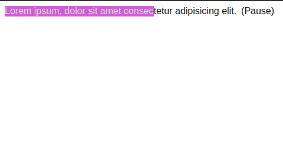

# INLINE AUDIO PLAYER 🎵

Play audio files inline in your blog posts. You just need to wrap a pure text node with the `inline-audio-player` web component.



> warning: That component does not read the text passed to it, it plays and pauses an external audio source. You can use it play some sound effects, for example. If you want to play audio from a text, you should use some text to speech API / library. This component is not intended to be used for that.

## Usage

```html
<inline-audio-player src="/clap.mp3">
  and everyone clapped
  <div slot="pause-icon">(Pause)</div>
  <div slot="play-icon">(Play)</div>
</inline-audio-player>
```

## Attributes

- `src`: The URL of the audio file to play.
- `loop`: Whether to loop the audio file or not. Defaults to `false`.

## Slots

- `default`: A text node. If you pass something different the percentage played will not be highlighted.

- `pause-icon`: The content to show as the pause icon. Defaults to `❚❚`.

- `play-icon`: The content to show as the play icon. Defaults to `▶`.

## Styling

The component exposes the following CSS custom properties:

```css
--inline-audio-player-highlight-background: yellow;
--inline-audio-player-highlight-color: black;
```

- `--inline-audio-player-highlight-background`: The background color of the text that corresponds to the current percentage played. Defaults to `yellow`.
- `--inline-audio-player-highlight-color`: The text color of the text that corresponds to the current percentage played. Defaults to `black`.
